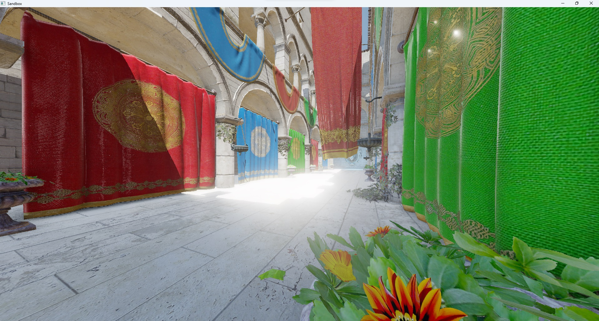
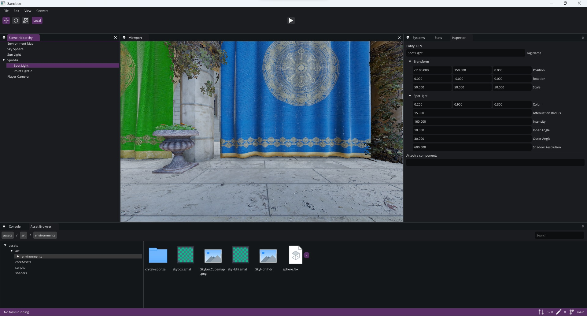

# The Grindstone Engine

The Grindstone Engine is an extensible engine that contains all tools to create modern games. It includes a C# Scripting Engine, IBL and PBR-based graphics, a visual editor, and more.

## Building
 - Install [vcpkg](https://vcpkg.io/en/getting-started.html) and [CMake](https://cmake.org/install/).
 - Configure the location of CMAKE_TOOLCHAIN_FILE or set the environment variable VCPKG_PATH.
 - Install Mono Project
 - Copy mono-2.0-sgen.dll to the bin folder
 - Just run Cmake!

## Example Project

Download the sample project [Grindstone Sandbox](https://github.com/KarimIO/Grindstone-Sandbox).

Run `ApplicationExecutable.exe` with the arguments `-projectpath "Path\To\Project"` to run the project.

## Documentation

You can find the documentation for Grindstone here: https://karimio.github.io/Grindstone/

You can also generate it yourself by following these steps, which is especially useful if you want documentation for a branch other than main:

 * Install [Doxygen](https://www.doxygen.nl/manual/install.html).
 * In a terminal, run `doxygen` when in the `/docs` subdirectory of this project.
 * It will generate documentation, which you can find, relative to the root directory, in: `../GrindstoneDoxygen/html/index.html`.

## License
Please view the [LICENSE.md](LICENSE.md) file for information on the MIT License, which this project uses.

## Contributing
Please view [CONTRIBUTING.md](CONTRIBUTING.md) file for information on how to report issues and contribute code.
