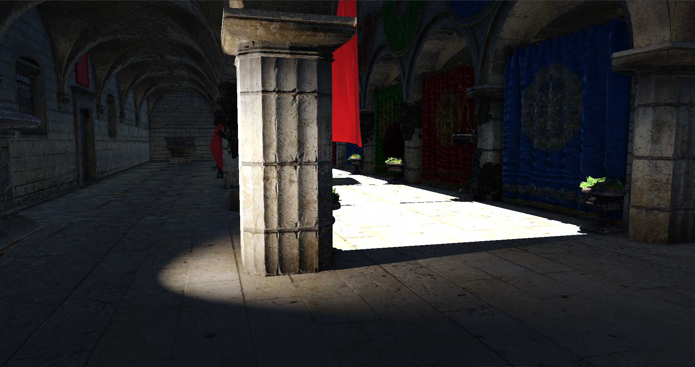

# The Grindstone Engine

The Grindstone Engine is an extensible engine that contains all tools to create modern games. It includes a C# Scripting Engine, IBL and PBR-based graphics, a visual editor, and more.

## Building
 - Install [vcpkg](https://vcpkg.io/en/getting-started.html) and [CMake](https://cmake.org/install/).
 - Configure the location of CMAKE_TOOLCHAIN_FILE or set the environment variable VCPKG_PATH.
 - Install Mono Project
 - Copy mono-2.0-sgen.dll to the bin folder
 - Just run Cmake!

## Example Project
Run `ApplicationExecutable.exe` with `-projectpath "Path\To\Project"` to run a project.
[Grindstone Sandbox](https://github.com/KarimIO/Grindstone-Sandbox).

## License
Please view the [LICENSE.md](LICENSE.md) file for information on the MIT License, which this project uses.

## Contributing
Please view [CONTRIBUTING.md](CONTRIBUTING.md) file for information on how to report issues and contribute code.
